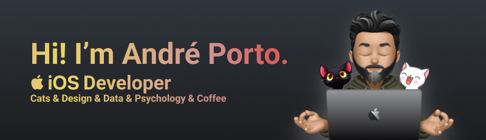
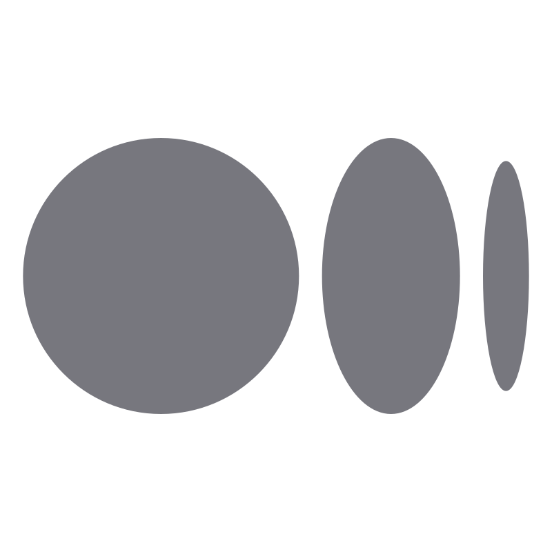
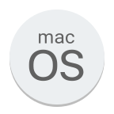

Brazilian iOS developer focused on delivering exceptional results through innovative app development, optimization and integration using SwiftUI.

With a background in psychology and graphic design, I bring over 20 years of experience in design, web development and user interface design. Along the way, I've learned other programming languages in addition to Swift, including JavaScript, Python, SQL, Data Analysis and many others.

    
    
    
    
    
    
    <!-- 
 -->

## My spot

  
  
  
  
  <!--  -->
  
  
<!--    -->
  
  
  

 
  
  
  
  
  
  

## Stats

<!-- 

 -->
