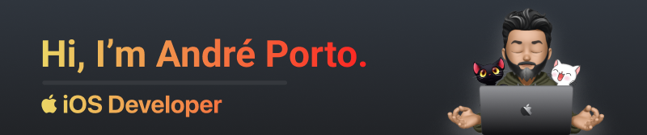
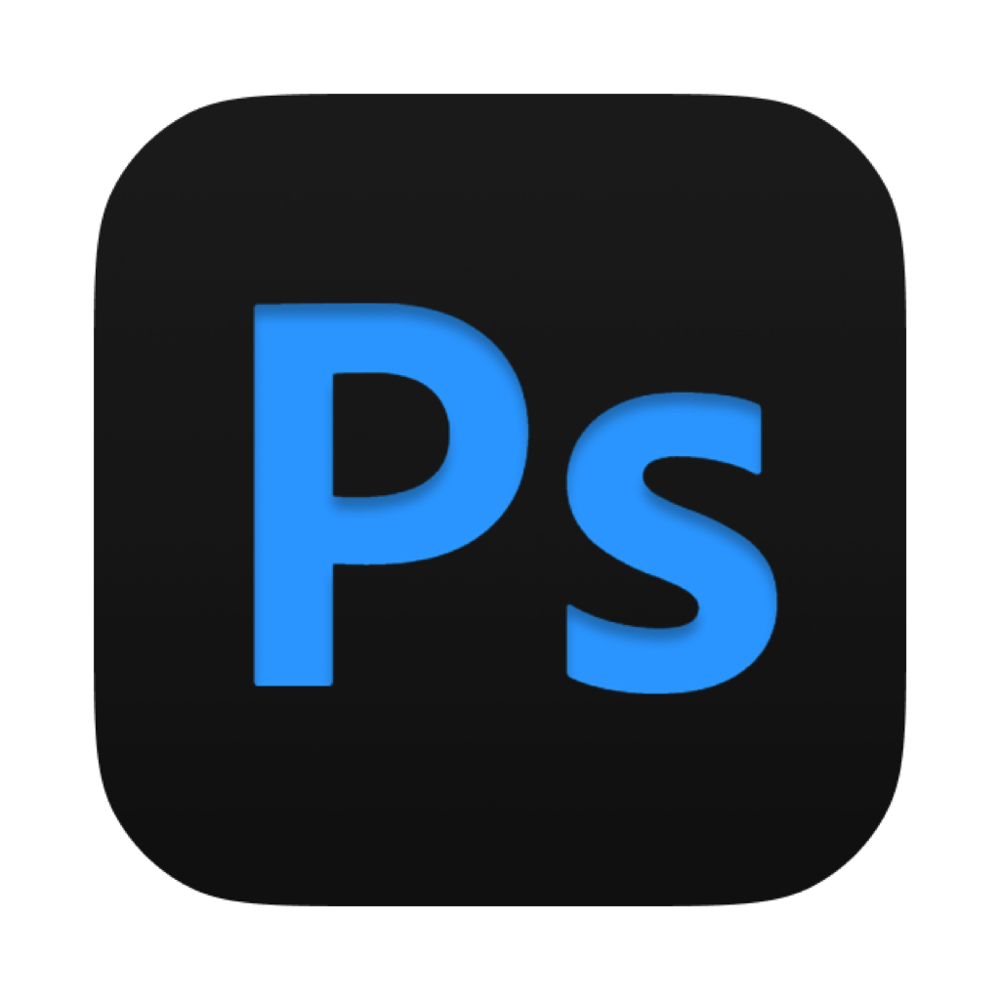

Over 20 years of experience in design, web development, and user interface design. I am passionate about building innovative user-friendly apps using SwiftUI and committed to delivering exceptional and beautiful results. Coffee Oriented Developer ☕️

- 🌍 I'm based in Brazil
- 🖥️ See my portfolio at [andreporto.dev](http://andreporto.dev.br)
- ✉️ You can contact me at [andreporto@me.com](mailto:andreporto@me.com)
- 🚀 I'm currently working on [Jr. SwiftLab](http://andreporto.dev.br/jrswiftlab.app.html)
- 🧠 I'm learning ViewCode right now

## Socials

<!--  -->

## Language Skills

  <!--  -->
  
  
  
  
  
  
  <!-- 
   -->
<!--    -->
  
  
  

## UI/UX Skills

  
  
  
  
  
  

## Core Stats

### Support Me

<li style="display: inline-block; margin-right: 0.25rem;"></li>
